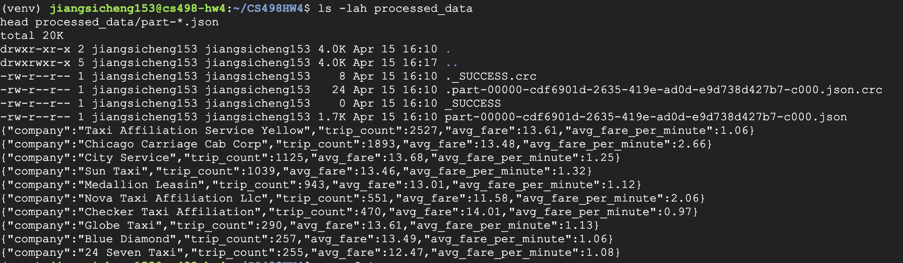

# CS498 HW4

This repository contains the scaffold for HW4, which combines:

- Neo4j graph loading and query APIs
- PySpark preprocessing and analytics APIs
- FoundationDB short-answer questions
- A short design analysis PDF

## Repository Layout

- `app.py`: Flask API entrypoint for Neo4j and Spark endpoints
- `clean.py`: cleaning script for the taxi trips dataset
- `load_graph.py`: Neo4j import script
- `preprocess.py`: PySpark preprocessing job
- `processed_data/`: JSON output directory from Spark
- `fdb_answers.txt`: FoundationDB concept answers
- `Design.pdf`: short design analysis deliverable
- `Team.txt`: NetID submission file
- `HW4.txt`: deployed service address in `IP:PORT` format

## Status

- Scaffold created
- Business logic still needs implementation
- `processed_data/` output proof added below

## Run Plan

1. Generate `taxi_trips_clean.csv` with `clean.py`
2. Load Neo4j with `load_graph.py`
3. Run `preprocess.py` to populate `processed_data/`
4. Start `app.py` on `0.0.0.0:5000`
5. Fill in `Team.txt`, `HW4.txt`, `fdb_answers.txt`, and finalize `Design.pdf`

## Processed Data Output

The screenshot below shows the contents of `processed_data/`, including `_SUCCESS` and the first lines of a `part-*` JSON file. 

